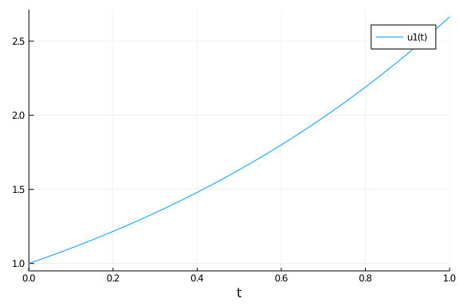
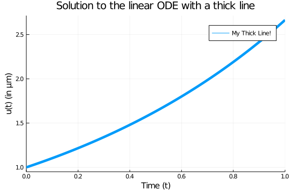
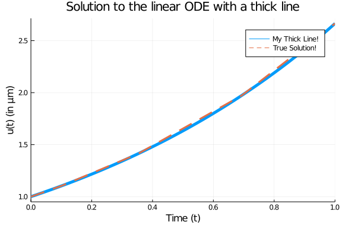
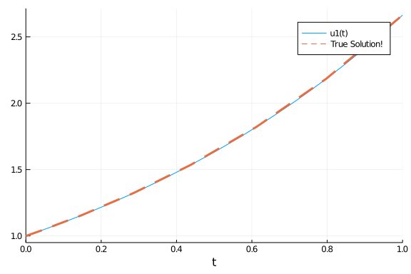
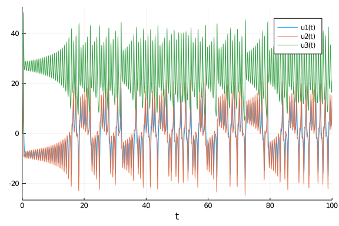
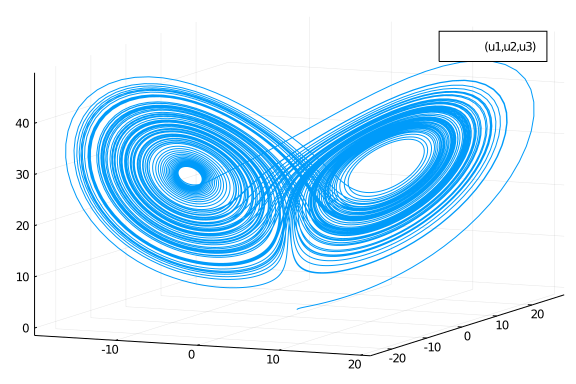
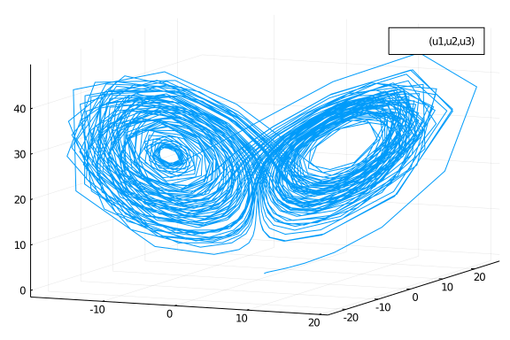
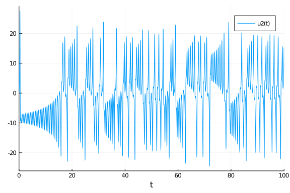

## Basic Introduction Via Ordinary Differential Equations

This notebook will get you started with DifferentialEquations.jl by introducing you to the functionality for solving ordinary differential equations (ODEs). The corresponding documentation page is the [ODE tutorial](https://docs.juliadiffeq.org/dev/tutorials/ode_example/). While some of the syntax may be different for other types of equations, the same general principles hold in each case. Our goal is to give a gentle and thorough introduction that highlights these principles in a way that will help you generalize what you have learned.

### Background

If you are new to the study of differential equations, it can be helpful to do a quick background read on [the definition of ordinary differential equations](https://en.wikipedia.org/wiki/Ordinary_differential_equation). We define an ordinary differential equation as an equation which describes the way that a variable $u$ changes, that is

$$u' = f(u,p,t)$$

where $p$ are the parameters of the model, $t$ is the time variable, and $f$ is the nonlinear model of how $u$ changes. The initial value problem also includes the information about the starting value:

$$u(t_0) = u_0$$

Together, if you know the starting value and you know how the value will change with time, then you know what the value will be at any time point in the future. This is the intuitive definition of a differential equation.

### First Model: Exponential Growth

Our first model will be the canonical exponential growth model. This model says that the rate of change is proportional to the current value, and is this:

$$u' = au$$

where we have a starting value $u(0)=u_0$. Let's say we put 1 dollar into Bitcoin which is increasing at a rate of $98\%$ per year. Then calling now $t=0$ and measuring time in years, our model is:

$$u' = 0.98u$$

and $u(0) = 1.0$. We encode this into Julia by noticing that, in this setup, we match the general form when

````julia
f(u,p,t) = 0.98u
````


````
f (generic function with 1 method)
````


with $ u_0 = 1.0 $. If we want to solve this model on a time span from `t=0.0` to `t=1.0`, then we define an `ODEProblem` by specifying this function `f`, this initial condition `u0`, and this time span as follows:

````julia
using DifferentialEquations
f(u,p,t) = 0.98u
u0 = 1.0
tspan = (0.0,1.0)
prob = ODEProblem(f,u0,tspan)
````


````
ODEProblem with uType Float64 and tType Float64. In-place: false
timespan: (0.0, 1.0)
u0: 1.0
````


To solve our `ODEProblem` we use the command `solve`.

````julia
sol = solve(prob)
````


````
retcode: Success
Interpolation: Automatic order switching interpolation
t: 5-element Array{Float64,1}:
 0.0
 0.10042494449239292
 0.35218603951893646
 0.6934436028208104
 1.0
u: 5-element Array{Float64,1}:
 1.0
 1.1034222047865465
 1.4121908848175448
 1.9730384275622996
 2.664456142481451
````


and that's it: we have succesfully solved our first ODE!

#### Analyzing the Solution

Of course, the solution type is not interesting in and of itself. We want to understand the solution! The documentation page which explains in detail the functions for analyzing the solution is the [Solution Handling](https://docs.juliadiffeq.org/dev/basics/solution/) page. Here we will describe some of the basics. You can plot the solution using the plot recipe provided by [Plots.jl](http://docs.juliaplots.org/dev/):

````julia
using Plots; gr()
plot(sol)
````





From the picture we see that the solution is an exponential curve, which matches our intuition. As a plot recipe, we can annotate the result using any of the [Plots.jl attributes](http://docs.juliaplots.org/dev/attributes/). For example:

````julia
plot(sol,linewidth=5,title="Solution to the linear ODE with a thick line",
     xaxis="Time (t)",yaxis="u(t) (in μm)",label="My Thick Line!") # legend=false
````





Using the mutating `plot!` command we can add other pieces to our plot. For this ODE we know that the true solution is $u(t) = u_0 exp(at)$, so let's add some of the true solution to our plot:

````julia
plot!(sol.t, t->1.0*exp(0.98t),lw=3,ls=:dash,label="True Solution!")
````





In the previous command I demonstrated `sol.t`, which grabs the array of time points that the solution was saved at:

````julia
sol.t
````


````
5-element Array{Float64,1}:
 0.0
 0.10042494449239292
 0.35218603951893646
 0.6934436028208104
 1.0
````


We can get the array of solution values using `sol.u`:

````julia
sol.u
````


````
5-element Array{Float64,1}:
 1.0
 1.1034222047865465
 1.4121908848175448
 1.9730384275622996
 2.664456142481451
````


`sol.u[i]` is the value of the solution at time `sol.t[i]`. We can compute arrays of functions of the solution values using standard comprehensions, like:

````julia
[t+u for (u,t) in tuples(sol)]
````


````
5-element Array{Float64,1}:
 1.0
 1.2038471492789395
 1.7643769243364813
 2.66648203038311
 3.664456142481451
````


However, one interesting feature is that, by default, the solution is a continuous function. If we check the print out again:

````julia
sol
````


````
retcode: Success
Interpolation: Automatic order switching interpolation
t: 5-element Array{Float64,1}:
 0.0
 0.10042494449239292
 0.35218603951893646
 0.6934436028208104
 1.0
u: 5-element Array{Float64,1}:
 1.0
 1.1034222047865465
 1.4121908848175448
 1.9730384275622996
 2.664456142481451
````


you see that it says that the solution has a order changing interpolation. The default algorithm automatically switches between methods in order to handle all types of problems. For non-stiff equations (like the one we are solving), it is a continuous function of 4th order accuracy. We can call the solution as a function of time `sol(t)`. For example, to get the value at `t=0.45`, we can use the command:

````julia
sol(0.45)
````


````
1.554261048055312
````


#### Controlling the Solver

DifferentialEquations.jl has a common set of solver controls among its algorithms which can be found [at the Common Solver Options](https://docs.juliadiffeq.org/dev/basics/common_solver_opts/) page. We will detail some of the most widely used options.

The most useful options are the tolerances `abstol` and `reltol`. These tell the internal adaptive time stepping engine how precise of a solution you want. Generally, `reltol` is the relative accuracy while `abstol` is the accuracy when `u` is near zero. These tolerances are local tolerances and thus are not global guarantees. However, a good rule of thumb is that the total solution accuracy is 1-2 digits less than the relative tolerances. Thus for the defaults `abstol=1e-6` and `reltol=1e-3`, you can expect a global accuracy of about 1-2 digits. If we want to get around 6 digits of accuracy, we can use the commands:

````julia
sol = solve(prob,abstol=1e-8,reltol=1e-8)
````


````
retcode: Success
Interpolation: Automatic order switching interpolation
t: 9-element Array{Float64,1}:
 0.0
 0.04127492324135852
 0.14679917846877366
 0.28631546412766684
 0.4381941361169628
 0.6118924302028597
 0.7985659100883337
 0.9993516479536952
 1.0
u: 9-element Array{Float64,1}:
 1.0
 1.0412786454705882
 1.1547261252949712
 1.3239095703537043
 1.5363819257509728
 1.8214895157178692
 2.1871396448296223
 2.662763824115295
 2.664456241933517
````


Now we can see no visible difference against the true solution:


````julia
plot(sol)
plot!(sol.t, t->1.0*exp(0.98t),lw=3,ls=:dash,label="True Solution!")
````





Notice that by decreasing the tolerance, the number of steps the solver had to take was `9` instead of the previous `5`. There is a trade off between accuracy and speed, and it is up to you to determine what is the right balance for your problem.

Another common option is to use `saveat` to make the solver save at specific time points. For example, if we want the solution at an even grid of `t=0.1k` for integers `k`, we would use the command:

````julia
sol = solve(prob,saveat=0.1)
````


````
retcode: Success
Interpolation: 1st order linear
t: 11-element Array{Float64,1}:
 0.0
 0.1
 0.2
 0.3
 0.4
 0.5
 0.6
 0.7
 0.8
 0.9
 1.0
u: 11-element Array{Float64,1}:
 1.0
 1.102962785129292
 1.2165269512238264
 1.341783821227542
 1.4799379510586077
 1.632316207054161
 1.8003833264983584
 1.9857565541588758
 2.1902158127997695
 2.415725742084496
 2.664456142481451
````


Notice that when `saveat` is used the continuous output variables are no longer saved and thus `sol(t)`, the interpolation, is only first order. We can save at an uneven grid of points by passing a collection of values to `saveat`. For example:

````julia
sol = solve(prob,saveat=[0.2,0.7,0.9])
````


````
retcode: Success
Interpolation: 1st order linear
t: 3-element Array{Float64,1}:
 0.2
 0.7
 0.9
u: 3-element Array{Float64,1}:
 1.2165269512238264
 1.9857565541588758
 2.415725742084496
````


If we need to reduce the amount of saving, we can also turn off the continuous output directly via `dense=false`:

````julia
sol = solve(prob,dense=false)
````


````
retcode: Success
Interpolation: 1st order linear
t: 5-element Array{Float64,1}:
 0.0
 0.10042494449239292
 0.35218603951893646
 0.6934436028208104
 1.0
u: 5-element Array{Float64,1}:
 1.0
 1.1034222047865465
 1.4121908848175448
 1.9730384275622996
 2.664456142481451
````


and to turn off all intermediate saving we can use `save_everystep=false`:

````julia
sol = solve(prob,save_everystep=false)
````


````
retcode: Success
Interpolation: 1st order linear
t: 2-element Array{Float64,1}:
 0.0
 1.0
u: 2-element Array{Float64,1}:
 1.0
 2.664456142481451
````


If we want to solve and only save the final value, we can even set `save_start=false`.

````julia
sol = solve(prob,save_everystep=false,save_start = false)
````


````
retcode: Success
Interpolation: 1st order linear
t: 1-element Array{Float64,1}:
 1.0
u: 1-element Array{Float64,1}:
 2.664456142481451
````


Note that similarly on the other side there is `save_end=false`.

More advanced saving behaviors, such as saving functionals of the solution, are handled via the `SavingCallback` in the [Callback Library](https://docs.juliadiffeq.org/dev/features/callback_library/#saving_callback-1) which will be addressed later in the tutorial.

#### Choosing Solver Algorithms

There is no best algorithm for numerically solving a differential equation. When you call `solve(prob)`, DifferentialEquations.jl makes a guess at a good algorithm for your problem, given the properties that you ask for (the tolerances, the saving information, etc.). However, in many cases you may want more direct control. A later notebook will help introduce the various *algorithms* in DifferentialEquations.jl, but for now let's introduce the *syntax*.

The most crucial determining factor in choosing a numerical method is the stiffness of the model. Stiffness is roughly characterized by a Jacobian `f` with large eigenvalues. That's quite mathematical, and we can think of it more intuitively: if you have big numbers in `f` (like parameters of order `1e5`), then it's probably stiff. Or, as the creator of the MATLAB ODE Suite, Lawrence Shampine, likes to define it, if the standard algorithms are slow, then it's stiff. We will go into more depth about diagnosing stiffness in a later tutorial, but for now note that if you believe your model may be stiff, you can hint this to the algorithm chooser via `alg_hints = [:stiff]`.

````julia
sol = solve(prob,alg_hints=[:stiff])
````


````
retcode: Success
Interpolation: specialized 3rd order "free" stiffness-aware interpolation
t: 8-element Array{Float64,1}:
 0.0
 0.05653299582822294
 0.17270731152826024
 0.3164602871490142
 0.5057500163821153
 0.7292241858994543
 0.9912975001018789
 1.0
u: 8-element Array{Float64,1}:
 1.0
 1.0569657840332976
 1.1844199383303913
 1.3636037723365293
 1.6415399686182572
 2.0434491434754793
 2.641825616057761
 2.6644526430553817
````


Stiff algorithms have to solve implicit equations and linear systems at each step so they should only be used when required.

If we want to choose an algorithm directly, you can pass the algorithm type after the problem as `solve(prob,alg)`. For example, let's solve this problem using the `Tsit5()` algorithm, and just for show let's change the relative tolerance to `1e-6` at the same time:

````julia
sol = solve(prob,Tsit5(),reltol=1e-6)
````


````
retcode: Success
Interpolation: specialized 4th order "free" interpolation
t: 10-element Array{Float64,1}:
 0.0
 0.028970819746309166
 0.10049147151547619
 0.19458908698515082
 0.3071725081673423
 0.43945421453622546
 0.5883434923759523
 0.7524873357619015
 0.9293021330536031
 1.0
u: 10-element Array{Float64,1}:
 1.0
 1.0287982807225062
 1.1034941463604806
 1.2100931078233779
 1.351248605624241
 1.538280340326815
 1.7799346012651116
 2.090571742234628
 2.486102171447025
 2.6644562434913377
````


### Systems of ODEs: The Lorenz Equation

Now let's move to a system of ODEs. The [Lorenz equation](https://en.wikipedia.org/wiki/Lorenz_system) is the famous "butterfly attractor" that spawned chaos theory. It is defined by the system of ODEs:

$$
\begin{align}
\frac{dx}{dt} &= \sigma (y - x)\\
\frac{dy}{dt} &= x (\rho - z) -y\\
\frac{dz}{dt} &= xy - \beta z
\end{align}
$$

To define a system of differential equations in DifferentialEquations.jl, we define our `f` as a vector function with a vector initial condition. Thus, for the vector `u = [x,y,z]'`, we have the derivative function:

````julia
function lorenz!(du,u,p,t)
    σ,ρ,β = p
    du[1] = σ*(u[2]-u[1])
    du[2] = u[1]*(ρ-u[3]) - u[2]
    du[3] = u[1]*u[2] - β*u[3]
end
````


````
lorenz! (generic function with 1 method)
````


Notice here we used the in-place format which writes the output to the preallocated vector `du`. For systems of equations the in-place format is faster. We use the initial condition $u_0 = [1.0,0.0,0.0]$ as follows:

````julia
u0 = [1.0,0.0,0.0]
````


````
3-element Array{Float64,1}:
 1.0
 0.0
 0.0
````


Lastly, for this model we made use of the parameters `p`. We need to set this value in the `ODEProblem` as well. For our model we want to solve using the parameters $\sigma = 10$, $\rho = 28$, and $\beta = 8/3$, and thus we build the parameter collection:

````julia
p = (10,28,8/3) # we could also make this an array, or any other type!
````


````
(10, 28, 2.6666666666666665)
````


Now we generate the `ODEProblem` type. In this case, since we have parameters, we add the parameter values to the end of the constructor call. Let's solve this on a time span of `t=0` to `t=100`:

````julia
tspan = (0.0,100.0)
prob = ODEProblem(lorenz!,u0,tspan,p)
````


````
ODEProblem with uType Array{Float64,1} and tType Float64. In-place: true
timespan: (0.0, 100.0)
u0: [1.0, 0.0, 0.0]
````


Now, just as before, we solve the problem:

````julia
sol = solve(prob)
````


````
retcode: Success
Interpolation: Automatic order switching interpolation
t: 1294-element Array{Float64,1}:
   0.0
   3.5678604836301404e-5
   0.0003924646531993154
   0.0032624077544510573
   0.009058075635317072
   0.01695646895607931
   0.0276899566248403
   0.041856345938267966
   0.06024040228733675
   0.08368539694547242
   ⋮
  99.39403070915297
  99.47001147494375
  99.54379656909015
  99.614651558349
  99.69093823148101
  99.78733023233721
  99.86114450046736
  99.96115759510786
 100.0
u: 1294-element Array{Array{Float64,1},1}:
 [1.0, 0.0, 0.0]
 [0.9996434557625105, 0.0009988049817849058, 1.781434788799208e-8]
 [0.9961045497425811, 0.010965399721242457, 2.146955365838907e-6]
 [0.9693591634199452, 0.08977060667778931, 0.0001438018342266937]
 [0.9242043615038835, 0.24228912482984957, 0.0010461623302512404]
 [0.8800455868998046, 0.43873645009348244, 0.0034242593451028745]
 [0.8483309877783048, 0.69156288756671, 0.008487623500490047]
 [0.8495036595681027, 1.0145425335433382, 0.01821208597613427]
 [0.9139069079152129, 1.4425597546855036, 0.03669381053327124]
 [1.0888636764765296, 2.052326153029042, 0.07402570506414284]
 ⋮
 [12.999157033749652, 14.10699925404482, 31.74244844521858]
 [11.646131422021162, 7.2855792145502845, 35.365000488215486]
 [7.777555445486692, 2.5166095828739574, 32.030953593541675]
 [4.739741627223412, 1.5919220588229062, 27.249779003951755]
 [3.2351668945618774, 2.3121727966182695, 22.724936101772805]
 [3.310411964698304, 4.28106626744641, 18.435441144016366]
 [4.527117863517627, 6.895878639772805, 16.58544600757436]
 [8.043672261487556, 12.711555298531689, 18.12537420595938]
 [9.97537965430362, 15.143884806010783, 21.00643286956427]
````


The same solution handling features apply to this case. Thus `sol.t` stores the time points and `sol.u` is an array storing the solution at the corresponding time points.

However, there are a few extra features which are good to know when dealing with systems of equations. First of all, `sol` also acts like an array. `sol[i]` returns the solution at the `i`th time point.

````julia
sol.t[10],sol[10]
````


````
(0.08368539694547242, [1.0888636764765296, 2.052326153029042, 0.07402570506
414284])
````


Additionally, the solution acts like a matrix where `sol[j,i]` is the value of the `j`th variable at time `i`:

````julia
sol[2,10]
````


````
2.052326153029042
````


We can get a real matrix by performing a conversion:

````julia
A = Array(sol)
````


````
3×1294 Array{Float64,2}:
 1.0  0.999643     0.996105    0.969359     …   4.52712   8.04367   9.97538
 0.0  0.000998805  0.0109654   0.0897706        6.89588  12.7116   15.1439
 0.0  1.78143e-8   2.14696e-6  0.000143802     16.5854   18.1254   21.0064
````


This is the same as sol, i.e. `sol[i,j] = A[i,j]`, but now it's a true matrix. Plotting will by default show the time series for each variable:

````julia
plot(sol)
````





If we instead want to plot values against each other, we can use the `vars` command. Let's plot variable `1` against variable `2` against variable `3`:

````julia
plot(sol,vars=(1,2,3))
````





This is the classic Lorenz attractor plot, where the `x` axis is `u[1]`, the `y` axis is `u[2]`, and the `z` axis is `u[3]`. Note that the plot recipe by default uses the interpolation, but we can turn this off:

````julia
plot(sol,vars=(1,2,3),denseplot=false)
````





Yikes! This shows how calculating the continuous solution has saved a lot of computational effort by computing only a sparse solution and filling in the values! Note that in vars, `0=time`, and thus we can plot the time series of a single component like:

````julia
plot(sol,vars=(0,2))
````





## Internal Types

The last basic user-interface feature to explore is the choice of types. DifferentialEquations.jl respects your input types to determine the internal types that are used. Thus since in the previous cases, when we used `Float64` values for the initial condition, this meant that the internal values would be solved using `Float64`. We made sure that time was specified via `Float64` values, meaning that time steps would utilize 64-bit floats as well. But, by simply changing these types we can change what is used internally.

As a quick example, let's say we want to solve an ODE defined by a matrix. To do this, we can simply use a matrix as input.

````julia
A  = [1. 0  0 -5
      4 -2  4 -3
     -4  0  0  1
      5 -2  2  3]
u0 = rand(4,2)
tspan = (0.0,1.0)
f(u,p,t) = A*u
prob = ODEProblem(f,u0,tspan)
sol = solve(prob)
````


````
retcode: Success
Interpolation: Automatic order switching interpolation
t: 10-element Array{Float64,1}:
 0.0
 0.047858882373600906
 0.12300892627846947
 0.20700817825411505
 0.3162502225838086
 0.43978467908868063
 0.5859005675602895
 0.7374522072131137
 0.900559388106676
 1.0
u: 10-element Array{Array{Float64,2},1}:
 [0.5060496887912886 0.24036797170420154; 0.8540143044250956 0.251760693280
6038; 0.3039932625336703 0.7662213191794971; 0.6401471326828512 0.053271900
63679699]
 [0.3549910831633146 0.22534933691317505; 0.8070386262042758 0.392600504783
67103; 0.2552423151238056 0.726458362697541; 0.7936819533687074 0.165521548
05051872]
 [0.031557985943108324 0.1462963556127568; 0.6300563368356352 0.53484031788
07335; 0.26230341396763324 0.6876035367423371; 1.0007013985263113 0.3284578
5342579614]
 [-0.4428701543876865 -0.018971013807754428; 0.31804502536743634 0.59068265
88775995; 0.4199133267248345 0.698269367672524; 1.166813394682604 0.4801268
348198312]
 [-1.1984577177107876 -0.33862267015692804; -0.1748812630706053 0.539170184
4650586; 0.9073133592515505 0.8328073403088083; 1.24709655527012 0.60686168
86562399]
 [-2.1446376154414444 -0.7950203397422511; -0.6658423507928749 0.4025510231
9571423; 1.8801020537485715 1.1876144786385079; 1.1028640714566618 0.620453
9283340861]
 [-3.163658090030755 -1.3456796852460384; -0.8073778728202534 0.32310966454
588075; 3.5696478614109277 1.8953079152166024; 0.5402866392533955 0.4125321
2024456776]
 [-3.726089472573486 -1.721577233809554; 0.0018332490874085616 0.6023370006
110698; 5.701344689591593 2.8694153705763488; -0.5450473601689162 -0.095814
09905710336]
 [-3.2017328093672655 -1.588033884744252; 2.4239389893984677 1.615224623520
6151; 7.820186164651849 3.906334433736734; -2.2617643988546794 -0.970274800
808008]
 [-2.0360967047558907 -1.0793058551199106; 4.795486701546642 2.682375049533
7393; 8.600012946152406 4.320553688102609; -3.518004100192245 -1.6348430055
298562]
````


There is no real difference from what we did before, but now in this case `u0` is a `4x2` matrix. Because of that, the solution at each time point is matrix:

````julia
sol[3]
````


````
4×2 Array{Float64,2}:
 0.031558  0.146296
 0.630056  0.53484
 0.262303  0.687604
 1.0007    0.328458
````


In DifferentialEquations.jl, you can use any type that defines `+`, `-`, `*`, `/`, and has an appropriate `norm`. For example, if we want arbitrary precision floating point numbers, we can change the input to be a matrix of `BigFloat`:

````julia
big_u0 = big.(u0)
````


````
4×2 Array{BigFloat,2}:
 0.50605   0.240368
 0.854014  0.251761
 0.303993  0.766221
 0.640147  0.0532719
````


and we can solve the `ODEProblem` with arbitrary precision numbers by using that initial condition:

````julia
prob = ODEProblem(f,big_u0,tspan)
sol = solve(prob)
````


````
retcode: Success
Interpolation: Automatic order switching interpolation
t: 6-element Array{Float64,1}:
 0.0
 0.06010110629588271
 0.2664584898438424
 0.5626233507656817
 0.8794977689450869
 1.0
u: 6-element Array{Array{BigFloat,2},1}:
 [0.5060496887912886432303594119730405509471893310546875 0.2403679717042015
4401426771073602139949798583984375; 0.8540143044250956272378516587195917963
98162841796875 0.2517606932806037978167523760930635035037994384765625; 0.30
39932625336703164720120184938423335552215576171875 0.7662213191794970956749
466495239175856113433837890625; 0.64014713268285117209188683773390948772430
419921875 0.0532719006367969871718059948761947453022003173828125]
 [0.30934554113056351169177694707398103878248277889236373028979488366053409
50085699 0.2170733182203601803807721412647633168897033714732218846144418770
993160695740925; 0.78630695494079565658207107285952889537732035365455038336
84909294922101357060971 0.4222274062123280939802140476269380653459089992042
738873382649287649215134837421; 0.24890789834492260749470490071156084741753
84440667303381982843297998229198640869 0.7178157167085254303172675104100242
104800211471931623069287296647360736729803444; 0.83051106007625269167125774
86772188798090443827413547819086332162565385591320372 0.1933619801810403984
681393301486707777576589804146977025663431369391827616486279]
 [-0.8384537330908854438096618783519652121492598349736713441642667801995390
448471175 -0.18003096010878965946638922307745913742070785953824668999405619
2236585447300178; 0.0540233302145734434090451929731546268539924889752859943
1256058734385505723168534 0.57636283491082031216721227657549507486930910383
60340803845912219280967971976233; 0.642954640889987060984138570452602373947
6103279921757886574211333933189154310853 0.75232851218157563865254787415963
51858884875287544666063672225366259585998725881; 1.231950350105674103833593
118354353096937679292049075972574116304947569320505995 0.560619250712370713
4694405913140869554829586857845672431402727452678639311510698]
 [-3.0216314544458795658782705566585962268523128654925302751732744519139152
96045176 -1.264242766096347399613880713182057093614854254781929523039307661
969978542741941; -0.8338418339855531335100533940097139734717214310256900482
532394243482404454799908 0.319927586100961030594127640098734655203585279262
9574266872137612195790844622673; 3.2676115265765749719924811759564838606907
8968197755030204170571803225954643169 1.76356397381892088579181025127436116
4890429426832604360037636496954881553302186; 0.6609185362935055945220824679
063128296629966673783329420416389609544234229624333 0.463611286678482371852
7633136173103569345842456199122146508985527746357138489567]
 [-3.3575991488404564927855558000477192959848889911327205492861965803766246
62165255 -1.649218807093138758009213693548278523064513238364606571590834449
036259014867824; 2.00953242005018827682391194017929322656139993330554268697
2761236647460034880509 1.43449241893062248839221571134387718132461493536340
1384585605055959608431437623; 7.5886921547988251508715204834081412386819532
49579432372846043101766279078314106 3.7889336221996460058577922065731312827
3025925231384039790958174373627208119143; -2.012475585336622494250203209393
236228754512577429777128361456354485348394853636 -0.84043739495290454380237
00578210185239613682032011894464500888339878146623355889]
 [-2.0360892058214401038344151885519707308554783594041159062630730934681578
96522545 -1.079302321984904433832381443831793155665522061337864161755031690
438309861460103; 4.79550978844815191543700478503935059519157530125707076256
2925370120957306621794 2.68238703869366466922245719813348600149839855181262
9666271038006025868457492757; 8.6000248468664298721660152783502599285604737
03412313742144799262904094722757563 4.3205596289100283439877454474248882647
92049450898695610817374062319740611539141; -3.51801619066082880365224415660
8931903148672721167628371280776350286769145557735 -1.6348489642511724216068
22708657175028068231613458019826095424058443762339416828]
````


````julia
sol[1,3]
````


````
-0.838453733090885443809661878351965212149259834973671344164266780199539044
8471175
````


To really make use of this, we would want to change `abstol` and `reltol` to be small! Notice that the type for "time" is different than the type for the dependent variables, and this can be used to optimize the algorithm via keeping multiple precisions. We can convert time to be arbitrary precision as well by defining our time span with `BigFloat` variables:

````julia
prob = ODEProblem(f,big_u0,big.(tspan))
sol = solve(prob)
````


````
retcode: Success
Interpolation: Automatic order switching interpolation
t: 6-element Array{BigFloat,1}:
 0.0
 0.060101106295882714527500799233182546448134725595462951998294239128916194
96562852
 0.266458489843842420910972805067370397070102991811036121133178652552394749
6742193
 0.562623350765681725188686189174086089685433433099572391619608257320690407
8423751
 0.879497768945086892624300667988308062008524377312042546097031152996252370
6688132
 1.0
u: 6-element Array{Array{BigFloat,2},1}:
 [0.5060496887912886432303594119730405509471893310546875 0.2403679717042015
4401426771073602139949798583984375; 0.8540143044250956272378516587195917963
98162841796875 0.2517606932806037978167523760930635035037994384765625; 0.30
39932625336703164720120184938423335552215576171875 0.7662213191794970956749
466495239175856113433837890625; 0.64014713268285117209188683773390948772430
419921875 0.0532719006367969871718059948761947453022003173828125]
 [0.30934554113056348885575697954680035206201800174117652429324642528018951
37933396 0.2170733182203601759259022161024750704210915105894407303115692096
797870571711215; 0.78630695494079564570163519842888265714501756414450376456
10727242831195740044899 0.4222274062123281077358352363112441263482324620854
199369752900614901896665191352; 0.24890789834492260507711199078156465772281
49034098326725025458987532381149230911 0.7178157167085254263068841479833150
205891637534227169953173503148069205200606406; 0.83051106007625270927989721
65794014297828056564261028156476686340275486276971605 0.1933619801810404118
768345659187879196906466040240088465363201465927461879195417]
 [-0.8384537330908856492597779496634436596526242307862805315283287706426013
822174635 -0.18003096010878974704367364723330135389585205968978247737965913
54213505682968235; 0.054023330214573308778464319330797269360998516486218676
64241026665460222178582427 0.5763628349108202961558079436839948457731160891
073411032647230025801026993866247; 0.64295464088998719561093861538107577656
80436989522403319481686380730731831365503 0.7523285121815756762520178587822
796798163841699154250931790121664251074879899899; 1.23195035010567412383914
3903544292175003411108413295067757635876796206864288751 0.56061925071237074
6750158093141077365440582089287948796661804441433441869503113]
 [-3.0216314544458797701584143762240137020945271612059159772828409019847573
58032122 -1.264242766096347515289926980278808556267590419943933090670238441
369246047633432; -0.8338418339855531119122649369438929361278796076902324167
39732363625227787955427 0.3199275861009610295154736079656731908752796485758
245742663305848293353736176768; 3.26761152657657538362029019065707369530605
0645302146963777515210039742095729337 1.76356397381892106405697096725137014
1565485262715540053578368778913641453093939; 0.6609185362935054355697651897
392643554013979411128045870189137963709578999896831 0.463611286678482305878
7751234255793539688900448314641036067724378773548671192969]
 [-3.3575991488404565210594350089281241250188787830812440963047991504076250
61421442 -1.649218807093138768775022597452720684228868528978271555200840207
661004441465543; 2.00953242005018819694301595517009367313461134403172577742
1875770870520499026172 1.43449241893062245376590304517277457168045062167671
6686222006633223626083313722; 7.5886921547988251027226032953887258561791308
28480904918283500810937574736803383 3.7889336221996459815831252552263388998
26841484795244460185113821289295669908865; -2.01247558533662244505042481111
3355491248314591888491436873487605312790917111425 -0.8404373949529045182537
804114852128489293497277544329716238284647439536038793208]
 [-2.0360892058214398879794606331751573211555991342419067996586037539591321
81460053 -1.079302321984904335370298512471379071992058986173519361308921279
696472208493215; 4.79550978844815229317335831618326993907816010953891833881
9519605984798360749389 2.68238703869366484276145246230173945697917903360545
7076561647627671772312435002; 8.6000248468664299363694890982888812962798364
49339107045559844646151457838575265 4.3205596289100283812130259901130117329
24817838498562055804074028634174764668599; -3.51801619066082898580467939004
7592592601407885093518015991459304283805831877991 -1.6348489642511725190943
1620491797346032629419321962826435587717871481605761271]
````


Let's end by showing a more complicated use of types. For small arrays, it's usually faster to do operations on static arrays via the package [StaticArrays.jl](https://github.com/JuliaArrays/StaticArrays.jl). The syntax is similar to that of normal arrays, but for these special arrays we utilize the `@SMatrix` macro to indicate we want to create a static array.

````julia
using StaticArrays
A  = @SMatrix [ 1.0  0.0 0.0 -5.0
                4.0 -2.0 4.0 -3.0
               -4.0  0.0 0.0  1.0
                5.0 -2.0 2.0  3.0]
u0 = @SMatrix rand(4,2)
tspan = (0.0,1.0)
f(u,p,t) = A*u
prob = ODEProblem(f,u0,tspan)
sol = solve(prob)
````


````
retcode: Success
Interpolation: Automatic order switching interpolation
t: 10-element Array{Float64,1}:
 0.0
 0.04455509598199894
 0.11637362479314543
 0.19818979225041639
 0.30375638980453606
 0.42250786571012533
 0.5636346198943284
 0.7123049878501075
 0.8682879626896445
 1.0
u: 10-element Array{StaticArrays.SArray{Tuple{4,2},Float64,2,8},1}:
 [0.3557752479620684 0.5225887972148013; 0.7854269934321916 0.3267513684170
791; 0.2831186960723906 0.7345178142358535; 0.6361396456245201 0.8354200879
071108]
 [0.21400754465105865 0.326737284855396; 0.7245540672510227 0.3699914019192
916; 0.2627919572421836 0.7008580437452763; 0.7494733464638557 1.0922376203
938056]
 [-0.07832029961926573 -0.12580241306751921; 0.5532328246818718 0.283394507
7614164; 0.30102311482579647 0.7601710345367942; 0.9013042454792802 1.46369
60057219204]
 [-0.4957246815669198 -0.8342898706788047; 0.2783640454150575 -0.0071956815
43047228; 0.4716394017589992 1.046088966669381; 1.015649834682388 1.7955483
61405024]
 [-1.1314659883343396 -2.000974872142314; -0.12418865726822292 -0.559755656
0878034; 0.9223663195603164 1.8399544608900906; 1.046280898593979 2.0229306
589251217]
 [-1.8962633590820315 -3.519184139622803; -0.4943627905331876 -1.1602927944
436918; 1.7585876450263966 3.3845727342623615; 0.8867615117907003 1.9194360
970177369]
 [-2.691605083052951 -5.277193235421268; -0.5509923054083478 -1.32706410185
22424; 3.158732227031545 6.107229674372428; 0.3810078625424296 1.1710034320
501022]
 [-3.08976059978653 -6.480348221643046; 0.19184057034094792 -0.122332864464
2061; 4.9014491762154195 9.718031644665466; -0.5570102504949481 -0.47249370
259902435]
 [-2.5913273870819364 -6.136761668586658; 2.193867075433349 3.4661920960113
77; 6.543377477632886 13.494760410575868; -1.9602559539199218 -3.1595713027
951096]
 [-1.0969964903996923 -3.806784779331395; 4.967445395619531 8.7318576118096
71; 7.214653069261577 15.609515003685157; -3.374968781586875 -6.05259084459
5036]
````


````julia
sol[3]
````


````
4×2 StaticArrays.SArray{Tuple{4,2},Float64,2,8} with indices SOneTo(4)×SOne
To(2):
 -0.0783203  -0.125802
  0.553233    0.283395
  0.301023    0.760171
  0.901304    1.4637
````


## Conclusion

These are the basic controls in DifferentialEquations.jl. All equations are defined via a problem type, and the `solve` command is used with an algorithm choice (or the default) to get a solution. Every solution acts the same, like an array `sol[i]` with `sol.t[i]`, and also like a continuous function `sol(t)` with a nice plot command `plot(sol)`. The Common Solver Options can be used to control the solver for any equation type. Lastly, the types used in the numerical solving are determined by the input types, and this can be used to solve with arbitrary precision and add additional optimizations (this can be used to solve via GPUs for example!). While this was shown on ODEs, these techniques generalize to other types of equations as well.


## Appendix

 This tutorial is part of the DiffEqTutorials.jl repository, found at: <https://github.com/JuliaDiffEq/DiffEqTutorials.jl>

To locally run this tutorial, do the following commands:
```
using DiffEqTutorials
DiffEqTutorials.weave_file("introduction","01-ode_introduction.jmd")
```

Computer Information:
```
Julia Version 1.4.2
Commit 44fa15b150* (2020-05-23 18:35 UTC)
Platform Info:
  OS: Linux (x86_64-pc-linux-gnu)
  CPU: Intel(R) Xeon(R) CPU @ 2.30GHz
  WORD_SIZE: 64
  LIBM: libopenlibm
  LLVM: libLLVM-8.0.1 (ORCJIT, haswell)
Environment:
  JULIA_CUDA_MEMORY_LIMIT = 536870912
  JULIA_DEPOT_PATH = /builds/JuliaGPU/DiffEqTutorials.jl/.julia
  JULIA_PROJECT = @.
  JULIA_NUM_THREADS = 4

```

Package Information:

```
Status `/builds/JuliaGPU/DiffEqTutorials.jl/Project.toml`
[2169fc97-5a83-5252-b627-83903c6c433c] AlgebraicMultigrid 0.3.0
[7e558dbc-694d-5a72-987c-6f4ebed21442] ArbNumerics 1.0.5
[6e4b80f9-dd63-53aa-95a3-0cdb28fa8baf] BenchmarkTools 0.5.0
[be33ccc6-a3ff-5ff2-a52e-74243cff1e17] CUDAnative 3.1.0
[159f3aea-2a34-519c-b102-8c37f9878175] Cairo 1.0.3
[3a865a2d-5b23-5a0f-bc46-62713ec82fae] CuArrays 2.2.1
[55939f99-70c6-5e9b-8bb0-5071ed7d61fd] DecFP 0.4.10
[abce61dc-4473-55a0-ba07-351d65e31d42] Decimals 0.4.1
[ebbdde9d-f333-5424-9be2-dbf1e9acfb5e] DiffEqBayes 2.15.0
[eb300fae-53e8-50a0-950c-e21f52c2b7e0] DiffEqBiological 4.3.0
[459566f4-90b8-5000-8ac3-15dfb0a30def] DiffEqCallbacks 2.13.3
[f3b72e0c-5b89-59e1-b016-84e28bfd966d] DiffEqDevTools 2.21.0
[9fdde737-9c7f-55bf-ade8-46b3f136cc48] DiffEqOperators 4.10.0
[1130ab10-4a5a-5621-a13d-e4788d82bd4c] DiffEqParamEstim 1.14.1
[055956cb-9e8b-5191-98cc-73ae4a59e68a] DiffEqPhysics 3.2.0
[0c46a032-eb83-5123-abaf-570d42b7fbaa] DifferentialEquations 6.14.0
[31c24e10-a181-5473-b8eb-7969acd0382f] Distributions 0.23.4
[497a8b3b-efae-58df-a0af-a86822472b78] DoubleFloats 1.1.12
[f6369f11-7733-5829-9624-2563aa707210] ForwardDiff 0.10.10
[7073ff75-c697-5162-941a-fcdaad2a7d2a] IJulia 1.21.2
[23fbe1c1-3f47-55db-b15f-69d7ec21a316] Latexify 0.13.5
[c7f686f2-ff18-58e9-bc7b-31028e88f75d] MCMCChains 3.0.12
[eff96d63-e80a-5855-80a2-b1b0885c5ab7] Measurements 2.2.1
[961ee093-0014-501f-94e3-6117800e7a78] ModelingToolkit 3.1.1
[2774e3e8-f4cf-5e23-947b-6d7e65073b56] NLsolve 4.4.0
[429524aa-4258-5aef-a3af-852621145aeb] Optim 0.21.0
[1dea7af3-3e70-54e6-95c3-0bf5283fa5ed] OrdinaryDiffEq 5.41.0
[65888b18-ceab-5e60-b2b9-181511a3b968] ParameterizedFunctions 5.3.0
[91a5bcdd-55d7-5caf-9e0b-520d859cae80] Plots 1.4.0
[d330b81b-6aea-500a-939a-2ce795aea3ee] PyPlot 2.9.0
[731186ca-8d62-57ce-b412-fbd966d074cd] RecursiveArrayTools 2.4.4
[47a9eef4-7e08-11e9-0b38-333d64bd3804] SparseDiffTools 1.8.0
[684fba80-ace3-11e9-3d08-3bc7ed6f96df] SparsityDetection 0.3.2
[90137ffa-7385-5640-81b9-e52037218182] StaticArrays 0.12.3
[f3b207a7-027a-5e70-b257-86293d7955fd] StatsPlots 0.14.6
[c3572dad-4567-51f8-b174-8c6c989267f4] Sundials 4.2.2
[1986cc42-f94f-5a68-af5c-568840ba703d] Unitful 1.2.1
[44d3d7a6-8a23-5bf8-98c5-b353f8df5ec9] Weave 0.10.2
[b77e0a4c-d291-57a0-90e8-8db25a27a240] InteractiveUtils
[37e2e46d-f89d-539d-b4ee-838fcccc9c8e] LinearAlgebra
[44cfe95a-1eb2-52ea-b672-e2afdf69b78f] Pkg
```
